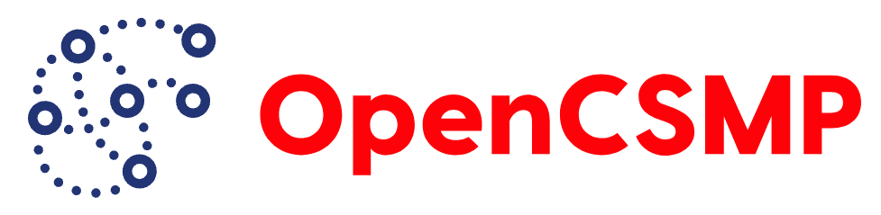
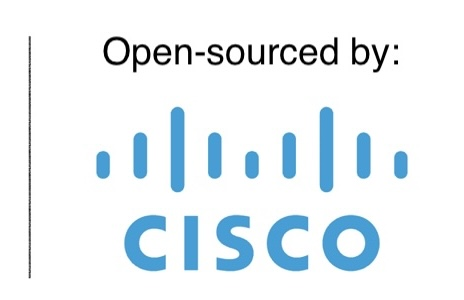

<p>
  
  
</p>

# OpenCSMP: Open-source CSMP Agent Library

## Overview 

[**OpenCSMP**](https://github.com/CiscoDevNet/csmp-agent-lib) is an open-sourced CSMP-Agent library (formerly CSMP-Agent) [open-sourced by Cisco in 2024](https://blogs.cisco.com/developer/cisco-announces-availability-of-opencsmp) for community use, development and adoption as a CiscoDevNet GitHub project (`csmp-agent-lib`) under Apache License 2.0.  
**CoAP Simple Management Protocol (CSMP)** is a device lifecycle management protocol optimized for resource constrained devices deployed within large-scale, bandwidth constrained IoT and [Wi-SUN](https://wi-sun.org/) networks.

`csmp-agent-lib` project provides a C implementation of a CoAP Simple Management Protocol (CSMP) agent library, a sample agent application, operating-system abstraction support, developer documentation, protocol-related tools, Protobuf TLV definitions, a Wireshark CSMP dissector, test utilities, and other helper scripts for platform integration. It is intended for device manufacturers, silicon vendors, and platform teams that need to connect resource-constrained IPv6 devices to a CSMP-compatible network management system such as [**Cisco Field Network Director (FND)**](https://www.cisco.com/site/us/en/products/networking/software/iot-field-network-director/index.html).

The library separates protocol behavior from platform services and device data. Vendors can port the Operating System Abstraction Layer (OSAL), provide callbacks for device-specific TLVs, and reuse the common CoAP, CSMP, protobuf, registration, reporting, signature, and firmware-management logic.
There are multiple target platforms supported by using OSAL. The repository provides Linux, FreeRTOS, Silicon Labs EFR32 Wi-SUN and Renesas Wi-SUN FAN device support. Refer to vendor specific README for more details on vendor implementations.

## Features

- IPv6/UDP CoAP client and server for CSMP communication
- CSMP Type/Length/Value framing with Protocol Buffers payloads
- Agent registration and periodic metrics reporting
- Standard device, interface, IP, routing, Wi-SUN, and system TLVs
- Firmware transfer, image block, load, backup, and reboot workflows
- Optional signed-message verification through an application callback
- Enterprise/vendor TLV support using IANA Private Enterprise Numbers
- Portable OSAL implementations for Linux, FreeRTOS, and Wi-SUN platforms
- Sample application, developer/integration guides and helper scripts
- [Wireshark CSMP dissector](tools/wireshark-csmp-dissector/), install/user guide and sample packet captures

## CoAP and CSMP Protocols

[Constrained Application Protocol (CoAP)](https://www.rfc-editor.org/rfc/rfc7252) is a lightweight web-transfer protocol for constrained devices and low-power or lossy networks. It applies REST concepts—URI-addressed resources and GET, POST, PUT, and DELETE operations—using a compact binary message format, normally over UDP. Confirmable messages provide retransmission when reliability is required; non-confirmable messages minimize overhead for telemetry and other best-effort traffic.

CoAP was developed through a series of IETF Internet-Drafts before the final wire format was standardized as [RFC 7252](https://www.rfc-editor.org/rfc/rfc7252). Some earlier legacy CSMP deployments used the pre-standard [CoAP draft-12 format](https://datatracker.ietf.org/doc/html/draft-ietf-core-coap-12), whose header layout differs from RFC 7252.

| Format | Status | CSMP usage in this project |
| --- | --- | --- |
| CoAP RFC 7252 | Final IETF standard | Agent library uses UDP port `61628`; Supported by the included Wireshark CSMP dissector |
| CoAP draft-12 | Pre-RFC Internet-Draft | Legacy CSMP traffic use UDP port `61624`; Supported by the included Wireshark CSMP dissector |

**CoAP Simple Management Protocol (CSMP)** is the device-management layer carried in CoAP requests and responses. In this repository, CSMP management objects use Type/Length/Value (TLV) framing, with each TLV value encoded using Protocol Buffers. The CSMP data model and wire schema are represented by the source, the committed [Protocol Buffer definition](src/csmpagent/tlvs/CsmpTlvs.proto), and the accompanying developer documentation. CSMP covers device registration, inventory and interface discovery, network and routing metrics, configuration, time synchronization, event reporting, group operations, firmware distribution, image activation, and reboot requests. Standard TLV identifiers support interoperability, while enterprise identifiers let vendors add platform-specific data without replacing the common protocol core.  

Together, CoAP and CSMP provide:

- **Bandwidth efficiency:** compact CoAP, TLV, and protobuf encodings reduce traffic on constrained links.
- **Selective reliability:** confirmable and non-confirmable exchanges let implementations balance delivery assurance against network cost.
- **Platform independence:** OSAL functions and TLV callbacks adapt the shared protocol behavior to each device and network stack.
- **Extensibility:** standard and vendor-specific TLVs can evolve within the same message model.
- **Scalable lifecycle management:** registration, telemetry, configuration, firmware delivery, and operational actions share one protocol framework.

Refer [Wireshark CSMP dissector README](tools/wireshark-csmp-dissector/README.md) for a more detailed information on CoAP and CSMP protocols, their wire-formats, TLVs and constituent Protobuf fields. The README also provides install and usage instructions for a functional [Wireshark CSMP Dissector](tools/wireshark-csmp-dissector) included in this project.

## Supported platforms

| Platform | Build target | Notes |
| --- | --- | --- |
| Linux/POSIX | `linux` | Reference development and sample environment |
| FreeRTOS POSIX port | `freertos` | Uses the FreeRTOS kernel Git submodule |
| Silicon Labs EFR32 Wi-SUN | `efr32_wisun` | Integrates with Silicon Labs Simplicity SDK 2024.6.0 |
| Renesas Wi-SUN FAN | Vendor project | Integrates with the Renesas Wi-SUN FAN stack and vendor toolchains |
| TexaxInstruments Wi-SUN FAN| Vendor project in progress | Integrates with the TexaxInstruments Wi-SUN FAN stack and vendor toolchains|

Platform-specific instructions are available in the [Silicon Labs guide](Vendors/Silabs/Readme.md) and [Renesas guide](Vendors/Renesas/Readme.md).

## Repository layout

```text
include/                  Public application headers
osal/                     Operating-system and platform abstraction layers
src/coap/                 CoAP transport implementation
src/csmptlv/              CSMP TLV framing and varint support
src/csmpagent/            TLV handlers and agent behavior
src/csmpagent/tlvs/       Protocol Buffer schema and generated C sources
src/csmpapi/              CSMP service API implementation
src/csmpservice/          Registration, reporting, and server orchestration
sample/                   Reference agent application and device callbacks
test/                     Packet captures and sample firmware images
tools/                    Firmware packaging and Wireshark tools
docs/                     Developer and firmware integration documentation
Vendors/                  Vendor-specific integration material
```

## Build prerequisites

For the Linux build, install:

- [GCC C and C++ compiler](https://help.ubuntu.com/community/InstallingCompilers) and build toolchain via `build-essential` package (make, libpthread, libc, libdl, etc.,)

	On Debian or Ubuntu:
	
	```sh
	sudo apt update
	sudo apt install build-essential
	```

- Though Protobuf compiler (`protoc-c`) is not required for a normal build. Install `protobuf-c-compiler` version 1.3.3 or later when modifying `CsmpTlvs.proto` and regenerating the updated protobuf. The generated protobuf C files are committed to the repository.

	```sh
	sudo apt update
	sudo apt-install protobuf-c-compiler
	```

## Build

Run commands from the repository root.

### Linux

```sh
./build.sh linux
```

This produces:

```text
sample/csmp_agent_lib.a
sample/CsmpAgentLib_sample
```

### FreeRTOS POSIX port

```sh
git submodule update --init --recursive
./build.sh freertos
```

### Silicon Labs EFR32 Wi-SUN

Prepare the Silicon Labs project and toolchain as described in the [EFR32 integration guide](Vendors/Silabs/Readme.md), then run:

```sh
./build.sh efr32_wisun
```
### Renesas - Wi-SUN FAN Platforms
For Renesas Wi-SUN FAN platforms, general information about the integration, supported platforms, requirements, dependencies and configurations can be found under the /Vendors/Renesas/ folder.

### Clean

```sh
./build.sh clean
```

To enable protocol debug logging, add `-DPRINTDEBUG` to the relevant target's compiler flags.

## Run the Linux sample application

The sample requires the IPv6 address of a reachable FND or compatible CSMP server:

```sh
sample/CsmpAgentLib_sample -d <FND_IPv6_ADDRESS>
```

Example with registration intervals and an explicit device EUI-64:

```sh
sample/CsmpAgentLib_sample \
  -d 2020::2020 \
  -min 10 \
  -max 100 \
  -eid 00173B1122334455
```

Supported Linux sample options include:

| Option | Meaning |
| --- | --- |
| `-d <IPv6>` | FND/NMS IPv6 address |
| `-min <seconds>` | Minimum registration interval |
| `-max <seconds>` | Maximum registration interval |
| `-eid <16 hex digits>` | Device EUI-64 registered in FND |
| `-ip <IPv6>` | Agent IPv6 address used by the sample |
| `-sig true` | Enables message signature check when built with crypto support. The check is disabled by default |

The EUI-64 must match the device identity configured in the management system. The minimum interval must be greater than zero and must not exceed the maximum interval.

## Add or extend a TLV

1. Allocate the TLV identifier in [src/csmpagent/csmp.h](src/csmpagent/csmp.h). For vendor TLVs, use the organization's assigned IANA Private Enterprise Number.
2. Add or update the protobuf message in [CsmpTlvs.proto](src/csmpagent/tlvs/CsmpTlvs.proto).
3. Regenerate the protobuf C sources:

   ```sh
   make -C src/csmpagent/tlvs
   ```
   Avoid editing `CsmpTlvs.pb-c.c` or `CsmpTlvs.pb-c.h` manually; they are generated files.

4. Implement encoding or decoding routines in `src/csmpagent/`.
5. Add the handler to the GET or POST dispatcher in [csmpagent.c](src/csmpagent/csmpagent.c).
6. Implement the application callback behavior and add interoperability tests.

## CoAP/CSMP packet decoding and inspection with Wireshark
The project includes a functional [**Wireshark CoAP/CSMP Dissector**](tools/wireshark-csmp-dissector) for decoding and inspecting **CoAP** and **CSMP** (CoAP Simple Management Protocol) traffic. It is intended to make CSMP exchanges easier to develop, decode, troubleshoot, and validate by decoding the transport framing, CoAP metadata, CSMP TLVs, and their application data in a single Wireshark packet view.
It provides visibility into the CSMP TLVs exchanged in Mesh networks between Smart Utility meters and FND or between any NMS/Device that communicates over CSMP. Helps faster triage, analysis, root-casing issues and packet captures from the field involving CSMP messaging.

**Features**:  
- Supports both the RFC7252 and Draft(legacy) CoAP formats and also provides preference to force decode a packet in the preferred format. Supports CSMP packet captures from both Wi-SUN and CGMESH Mesh stackmodes.  
- Displays the CoAP header, message metadata, token, options, URI path, payload, CSMP TLVs, raw Value bytes, and known Protobuf fields.  Helps distinguish incorrect CoAP framing, option errors, malformed VarInts or TLV lengths, unsupported TLV IDs, and Protobuf decoding problems.  
- Supports "csmp.*" Wireshark display filters for faster packet filtering. Works on all Wireshark supported platforms and packaged with install helper scripts.

The repository includes:

- [Wireshark CSMP Dissector](tools/wireshark-csmp-dissector/README.md) and protobuf schema under `tools/wireshark-csmp-dissector/`
- Dissector install and usage instructions in [Wireshark CSMP dissector README](tools/wireshark-csmp-dissector/README.md) ([.pdf](tools/wireshark-csmp-dissector/docs/coap-csmp-wireshark-dissector-readme.pdf))
- Sample captures under `tools/wireshark-csmp-dissector/pcap`
- Download latest release of [Wireshark CSMP Dissector v2.0](https://github.com/CiscoDevNet/csmp-agent-lib/releases/tag/v1.1.0)

## Firmware integration

Firmware management is split between protocol handlers in `src/csmpagent/csmp_firmwareMgmt.c` and platform storage operations in the OSAL. A production port must define its slot layout, maximum image size, persistent metadata, hashing and signature policy, atomic update behavior, rollback behavior, and reboot semantics.

Additional documentation and scripts are available in:

- [Cisco FND TPD Firmware Format Specification](docs/Cisco%20FND%20TPD%20Firmware%20Format%20Spec.pdf)
- [Cisco FND–OpenCSMP TPD Integration Guide](docs/Cisco%20FND-OpenCSMP%20TPD%20Integration%20Guide.pdf)
- The `tools/add_tpdheader.py` utility can add the required TPD header using `tools/tpd_config.json`.

## Security considerations

This project is a functional portable reference library and requires platform-specific security review and validation before production deployment. Applicable authentication/authorization mehcanisms to be enabled to ensure CSMP does not receive untrusted network data/commands which can initiate configuration, firmware, time, and reboot operations.

Production integrations should, at minimum:

- Enable a real cryptographic backend and fail closed when verification is unavailable.
- Validate every application callback value before changing device state.
- Enforce strict bounds on incoming TLV, protobuf, signature, and firmware data.
- Restrict communication to the configured management system(NMS) and trusted network path.
- Verify message authentication, firmware authenticity, storage integrity, and power-loss recovery.
- Run malformed-packet tests, fuzzing, sanitizers, and platform-specific security tests.
- Sample application's message signature check works when compiled with and enabled for a supported cryptographic implementation.

## Testing

The current repository provides packet captures and sample firmware images as interoperability fixtures. Contributors adding protocol or parser changes should include automated unit tests and packet-level regression tests. Linux builds are suitable for AddressSanitizer, UndefinedBehaviorSanitizer, and fuzzing before changes are moved to embedded targets.

## Documentation

- [CSMP Developer Tutorial](docs/CSMP%20Developer%20Tutorial%20-%200v11.pdf)
- [Wireshark CSMP Dissector](tools/wireshark-csmp-dissector/README.md) ([.pdf](tools/wireshark-csmp-dissector/docs/coap-csmp-wireshark-dissector-readme.pdf))
- [Silicon Labs EFR32 Wi-SUN integration](Vendors/Silabs/Readme.md)
- [Renesas Wi-SUN FAN integration](Vendors/Renesas/Readme.md)

API documentation can be generated with the provided `doxygen.config` file when Doxygen is installed:

```sh
doxygen doxygen.config
```

## Cisco open-source project

Cisco announced OpenCSMP on February 21, 2024, in the Cisco Developer Blog: [Cisco Announces Availability of OpenCSMP](https://blogs.cisco.com/developer/cisco-announces-availability-of-opencsmp). The announcement explains Cisco's decision to make its established CSMP device-management technology publicly available for third-party Wi-SUN and other resource-constrained devices, with an open-source agent library, Linux sample application, developer guidance, and protocol documentation.

Cisco published `csmp-agent-lib` under the [Apache License 2.0](LICENSE) so device manufacturers, silicon vendors, and community developers can implement CSMP agents on platforms outside Cisco's own product codebase. The repository provides the reusable protocol core, public API, OSAL boundary, reference application, packet-analysis tools, and integration documentation needed to create an independent platform port.

The project separates common CSMP behavior from vendor-owned implementation details. Cisco and community contributors can improve the shared protocol library, while adopters provide their operating-system services, device TLV data, cryptographic integration, firmware storage, and production validation. The Linux, FreeRTOS, Silicon Labs, and Renesas integrations illustrate this portability and contribution model.

## Contributing

Contributions that improve portability, protocol interoperability, security, tests, documentation, and vendor support are welcome. Keep platform-specific code behind the OSAL or application callback boundary, preserve protobuf wire compatibility, and document any toolchain or SDK constraints introduced by a change.

When reporting a defect, include the target platform, compiler and SDK versions, configuration, observed behavior, and—when possible—a minimal packet capture or reproducer. Do not publish credentials, private keys, certificates, production addresses, or sensitive device data.

## License

Licensed under the [Apache License 2.0](LICENSE).
