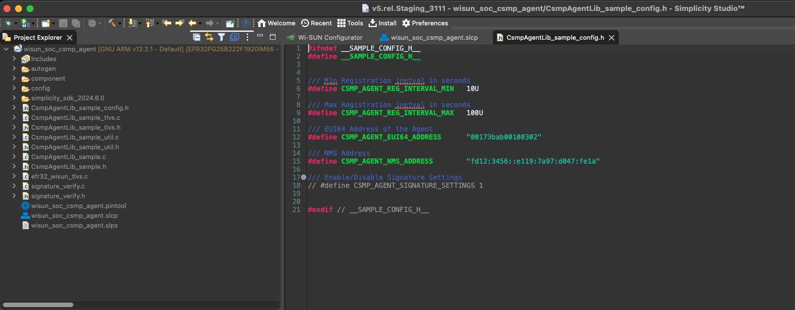
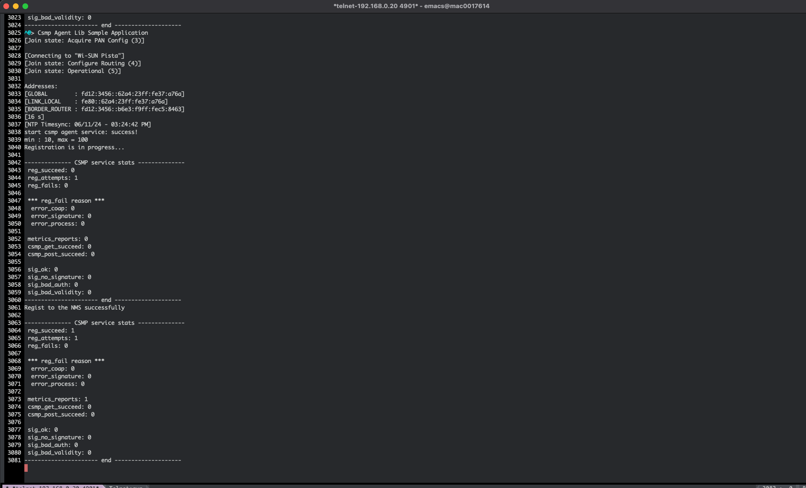
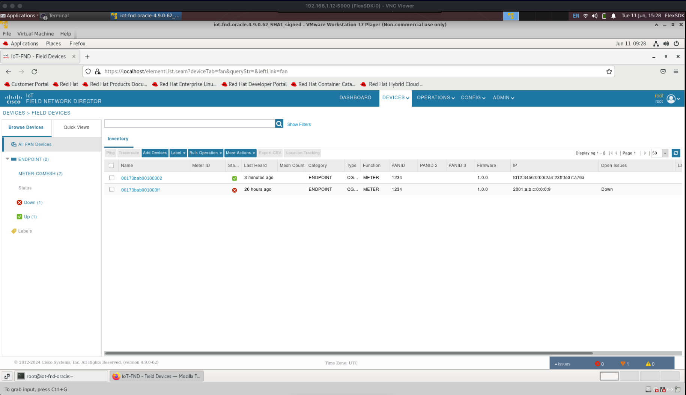

<table border="0">
  <tr>
    <td align="left" valign="middle">
      <h1>Silabs Wi-SUN CSMP Agent Project</h1>
      <a href="https://www.silabs.com/wireless/wi-sun">
        
      </a>
    </td>
    <td align="left" valign="middle">
      <a href="https://www.silabs.com/wireless/wi-sun">
        
      </a>
    </td>
  </tr>
</table>


# Summary

The Cisco Csmp Agent library and sample application are supported by Silicon Labs Simplicity SDK.

Silicon Labs provide a project that allows a Wi-SUN node to connect to FND using the Csmp Agent. The project is hosted on Silicon Labs [SiliconLabs/wisun_applications](https://github.com/SiliconLabs/wisun_applications).

## Requirements

- A running Cisco Field Network Director (FND).

- Silicon Labs Linux Border Router [wisun-br-linux](https://github.com/SiliconLabs/wisun-br-linux/tree/main)

- A Wi-SUN node running the project [wisun_soc_csmp_agent](https://github.com/SiliconLabs/wisun_applications/tree/main/wisun_soc_csmp_agent).

# Demo Setup

To connect a Wi-SUN node to FND, the user need three up and running entities. 

First, the user need to have access to FND or to have a running FND OVA virtual machine, second, is the Silicon Labs Linux Border Router that have backhaul connection and third is the Wi-SUN node running the **Wi-SUN - SoC Csmp Agent Sample Application**. In the following sections we will explain how to set up and configure each of those entities.

## Cisco FND OVA Virtual Machine

Cisco provides a virtual machine that runs FND for development purposes. To get the virtual machine and to setup the Cisco Field Network Director refer to the [CSMP Developer Tutorial](../../docs/CSMP%20Developer%20Tutorial%20-%200v11.pdf) PDF file.

## Silicon Labs Linux Border Router

A detailed guide to setup Silicon Labs Linux Border Router can be found on the [wisun-br-linux](https://github.com/SiliconLabs/wisun-br-linux/tree/main) Readme file. Please refer to the readme to set the Linux Wi-SUN Border Router.

> [!WARNING]  
> The Linux Border Router host should be connected to an IPv6 network and have a global-link address. Otherwise the node won't be able to register to Cisco FND.

### IPv6 Transparent Proxy

Once you have a working Linux border Router, you need configure the neighbor proxy to create and maintain a transparent bridge between Wi-SUN and the network interface used for backhaul connection. This can be achieved by setting the parameter neighbor_proxy to the network interface that you are using for backhaul connection on **wsbrd.conf** file.

``` C
neighbor_proxy=eth0
```
After that you should set up the IPv6 prefix to the same as the one used by the bridged interface (eth0 in the case of this user guide). 

``` C
ipv6_prefix = fa23:3d86::/64
```
The last step to have to set a transparent IPv6 proxy is to enable IPv6 forwarding on the host. Open a terminal on your Border Router host and run the following command:

``` C
sysctl net.ipv6.conf.all.forwarding=1
```
### NTP Server

For time synchronization purpose between FND and the Wi-SUN node, we have implemented an NTP client on the *Wi-SUN - SoC CSMP Agent Sample Application*.

The NTP server will be running on the border router host to simplify the demo setup. To install the NTP server and configure it please proceed with the following steps:

Install NTP on the host with following command: 
```
$ sudo apt install ntp
```

Edit the ntp.conf file and set the preferred NTP servers.

```
$ sudo nano /etc/ntp.conf
```

Copy past the following lines to the file.

``` bash
server 0.us.pool.ntp.org
server 1.us.pool.ntp.org
server 2.us.pool.ntp.org
server 3.us.pool.ntp.org
```

Restart the NTP server.

```
$ sudo service ntp restart
```

And finally configure the firewall settings for NTP.
```
$ sudo ufw allow from any to any port 123 proto udp
```

## Wi-SUN - SoC CSMP Agent Sample Application

The CSMP Agent Sample Application is hosted on [wisun_application](https://github.com/SiliconLabs/wisun_applications/tree/main/wisun_soc_csmp_agent)repository. If you didn't already create the project, please follow the project [readme](https://github.com/SiliconLabs/wisun_applications/blob/main/wisun_soc_csmp_agent/Readme.md) to do so. 

After creating the project you have to configure the CSMP Agent node to connect to FND.
The configuration evolves two defines:
* *CSMP_AGENT_EUI64_ADDRESS* that must contain 16 digits and will need to be set on FND side also. (Refer to the [CSMP Developer Tutorial](../../docs/CSMP%20Developer%20Tutorial%20-%200v11.pdf) section 3.2)
* *CSMP_AGENT_NMS_ADDRESS* Which is the FND link local address (Refer to the [CSMP Developer Tutorial](../../docs/CSMP%20Developer%20Tutorial%20-%200v11.pdf) section 3.1 step 10). 

The two options can be configured in *CsmpAgentLib_sample_config.h*, following is a screen shot of the configuration file.



Once you have configured the CSMP agent, please refer to the following [procedures](https://docs.silabs.com/simplicity-studio-5-users-guide/latest/ss-5-users-guide-building-and-flashing/) to build and flash the project.

# Connect to FND

At this level we have setup all the entities of this demo. To connect the Wi-SUN node to FND, start the Linux Border Router and join the Wi-SUN network with the node running the CSMP Agent.

Once the node is connected to the Border Router it will automatically start the registration to FND and sending a periodic metrics report.

Following is a screenshot of the node connecting to the Border Router and starting the registration process to FND.


#### Csmp Agent Sample Application CLI



Once registered we can check the node on the FND UI, following is a screenshot of the FND UI after the node have connected to FND.

#### The Wi-SUN node connected to Cisco FND

