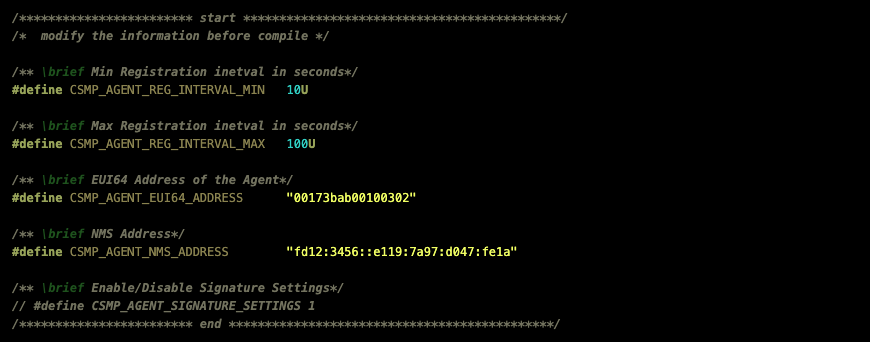

<table border="0">
  <tr>
    <td align="left" valign="middle">
      <a href="https://www.silabs.com/wireless/wi-sun">
        
      </a>
    </td>
  </tr>
</table>


# Summary

The Cisco Csmp Agent library and sample application are supported by Silicon Labs Simplicity SDK.

Silicon Labs provide project that allow a Wi-SUN node to connect to FND using the Csmp Agent. The project is hosted on Silicon Labs [SiliconLabs/wisun_applications](https://github.com/SiliconLabs/wisun_applications).

## Requirements

- A running Cisco Field Network Director (FND).

- *[Simplicity Studio v5](https://www.silabs.com/developers/simplicity-studio)*

- Silicon Labs Simplicity SDK: *[sisdk-2024.6](https://github.com/SiliconLabs/simplicity_sdk/tree/sisdk-2024.6)*

- Silicon Labs Linux Border Router *[wisun-br-linux](https://github.com/SiliconLabs/wisun-br-linux/tree/main)*

- A Wi-SUN node running the project *[wisun_soc_csmp_agent](https://github.com/SiliconLabs/wisun_applications/tree/main/wisun_soc_csmp_agent).*

- ARM GCC toolchain: *Arm GNU Toolchain 12.2* (Included in Simplicity Studio)

- python: *>= python3.6*

# Demo Setup

To connect a Wi-SUN node to FND, the user need three up and running entities. 

First, the user need to have access to FND or to have a running FND OVA virtual machine, second, is the Silicon Labs Linux Border Router that have backhaul connection and third is the Wi-SUN node running the **Wi-SUN - SoC Csmp Agent Skeleton** based Csmp Agent Sample Application. In the following sections we will explain how to set up and configure the project.

## Cisco FND OVA Virtual Machine

Cisco provides a virtual machine that runs FND for development purposes. To get the virtual machine and to setup the Cisco Field Network Director refer to the [CSMP Developer Tutorial](../../docs/CSMP%20Developer%20Tutorial%20-%200v11.pdf) PDF file.

## Silicon Labs Linux Border Router

A detailed guide to setup Silicon Labs Linux Border Router can be found on the [wisun-br-linux](https://github.com/SiliconLabs/wisun-br-linux/tree/main) Readme file. Please refer to the readme to set the Linux Wi-SUN Border Router.

> [!WARNING]  
> The Linux Border Router host should be connected to an IPv6 network and have a global-link address. Otherwise the node won't be able to register to Cisco FND.

### IPv6 Transparent Proxy

Once you have a working Linux border Router, you need configure the neighbor proxy to create and maintain a transparent bridge between Wi-SUN and the network interface used for backhaul connection. This can be achieved by setting the parameter neighbor_proxy to the network interface that you are using for backhaul connection on **wsbrd.conf** file.

``` C
neighbor_proxy=eth0
```
After that you should set up the IPv6 prefix to the same as the one used by the bridged interface (eth0 in the case of this user guide). 

``` C
ipv6_prefix = fa23:3d86::/64
```
The last step to have to set a transparent IPv6 proxy is to enable IPv6 forwarding on the host. Open a terminal on your Border Router host and run the following command:

``` C
sysctl net.ipv6.conf.all.forwarding=1
```
### NTP Server

For time synchronization purpose between FND and the Wi-SUN node, we have implemented an NTP client on the *Wi-SUN - SoC CSMP Agent Sample Application*.

The NTP server will be running on the border router host to simplify the demo setup. To install the NTP server and configure it please proceed with the following steps:

Install NTP on the host with following command: 
```
$ sudo apt install ntp
```

Edit the ntp.conf file and set the preferred NTP servers.

```
$ sudo nano /etc/ntp.conf
```

Copy past the following lines to the file.

``` bash
server 0.us.pool.ntp.org
server 1.us.pool.ntp.org
server 2.us.pool.ntp.org
server 3.us.pool.ntp.org
```

Restart the NTP server.

```
$ sudo service ntp restart
```

And finally configure the firewall settings for NTP.
```
$ sudo ufw allow from any to any port 123 proto udp
```

## Silicon Labs projects

The [wisun_application](https://github.com/SiliconLabs/wisun_applications/tree/main/wisun_soc_csmp_agent) repository includes the Skeleton example that allow building a Silabs Wi-SUN application that supports the CSMP agent. 

The Skeleton project allows to generate all the EFR32 platform and Wi-SUN dependent source files and configuration to be copied later to the csmp_agent_lib repository and built using the csmp repository system build

### Projects creation

After creating the project and generating makefile as explained in the project [readme](https://github.com/SiliconLabs/wisun_applications/blob/main/wisun_soc_csmp_agent/Readme.md), the *Wi-SUN - SoC CSMP Agent Skeleton* require to be moved to the CSMP Agent repository. 

To copy the project to the csmp_agent_lib, right click on the project name in Simplicity Studio and click on **[Browse File Here]**, you will be prompt to the project location, copy all the content under the project folder to the folder **csmp_agent_lib/Vendors/Silabs**.

After copying the skeleton project to the csmp_agent_lib, run the *make_silabs2cisco.py* script that modifies the project makefile to make sure we have the right GSK path and all the required includes.

``` Bash
$ python3 csmp_agent_lib/Vendors/Silabs/make_silabs2cisco.py
```

After this step you are ready to move to the project configuration section.

### Projects Configuration

After creating the project you have to configure the CSMP Agent node to connect to FND.
The configuration evolves two defines:
* *CSMP_AGENT_EUI64_ADDRESS* that must contain 16 digits and will need to be set on FND side also. (Refer to the [CSMP Developer Tutorial](../../docs/CSMP%20Developer%20Tutorial%20-%200v11.pdf) section 3.2)
* *CSMP_AGENT_NMS_ADDRESS* Which is the FND global address (Refer to the [CSMP Developer Tutorial](../../docs/CSMP%20Developer%20Tutorial%20-%200v11.pdf) section 3.1 step 10). 

The two options can be configured on the file *CsmpAgentLib_sample.h* that can be found under **csmp_agent_lib/sample** if you are using the skeleton project and in the project root if you are using the sample application, following is a screen shot of the sample application configuration file in studio.




### Projects Build and Flash

> If you are using Windows, you can use Git bash to run the commands in this section.

Before building, make sure that you are using the same GNU Arm Embedded Toolchain version in your environment as the one used by Simplicity Studio. 

To check the Toolchain version that was used to generate your project makefile right click on the project name in studio, click on **Properties** and on the project properties perspective click on **C/C++ Build** and check the version selected in Configuration.

On Git Bash run the following command to check the ARM GCC toolchain installed in your environment:

```bash
$ arm-none-eabi-gcc --version

```
If it is not the same version as the one used by Simplicity Studio, you can add the path to Simplicity studio Toolchain that can be found under *SiliconLabs\SimplicityStudio\v5\developer\toolchains\gnu_arm* to the *Environment Variables* Path. It is also important that the system variable **ARM_GCC_DIR** is updated to new toolchain path.

Once you have checked that you will use the right Toolchain to build, you can start the build with the following command:
```
$ ./build.sh efr32_wisun
```
When the build is finished you can find the project binary under **csmp_agent_lib/sample**. To flash the binary to your board you can use the Flash Programmer tool as explained [here](https://docs.silabs.com/simplicity-studio-5-users-guide/latest/ss-5-users-guide-building-and-flashing/flashing#flash-programmer). 


# Connect to FND

At this level we have setup all the entities of this demo. To connect the Wi-SUN node to FND, start the Linux Border Router and join the Wi-SUN network with the node running the CSMP Agent.

Once the node is connected to the Border Router it will automatically start the registration to FND and sending a periodic metrics report.

Following is a screenshot of the node connecting to the Border Router and starting the registration process to FND.


#### Csmp Agent Sample Application CLI


Once registered we can check the node on the FND UI, following is a screenshot of the FND UI after the node have connected to FND.

#### The Wi-SUN node connected to Cisco FND

