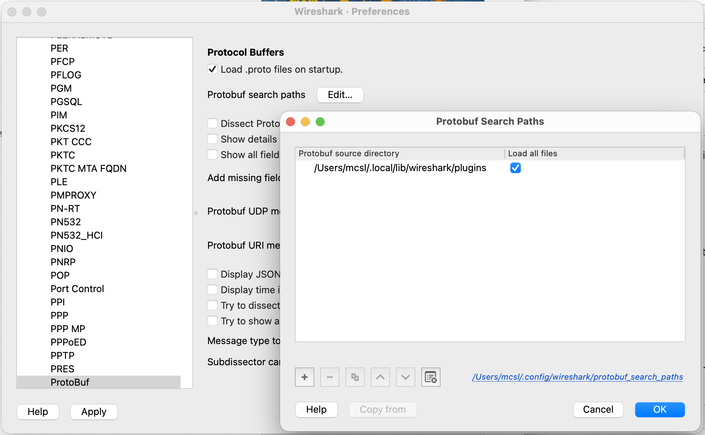
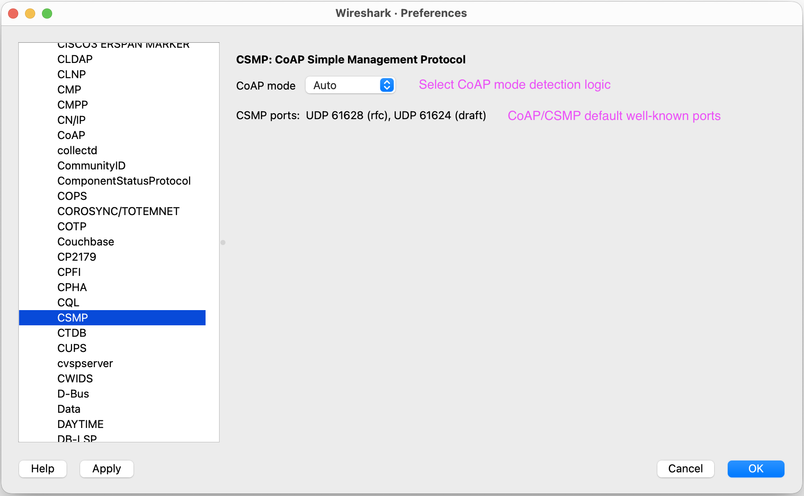
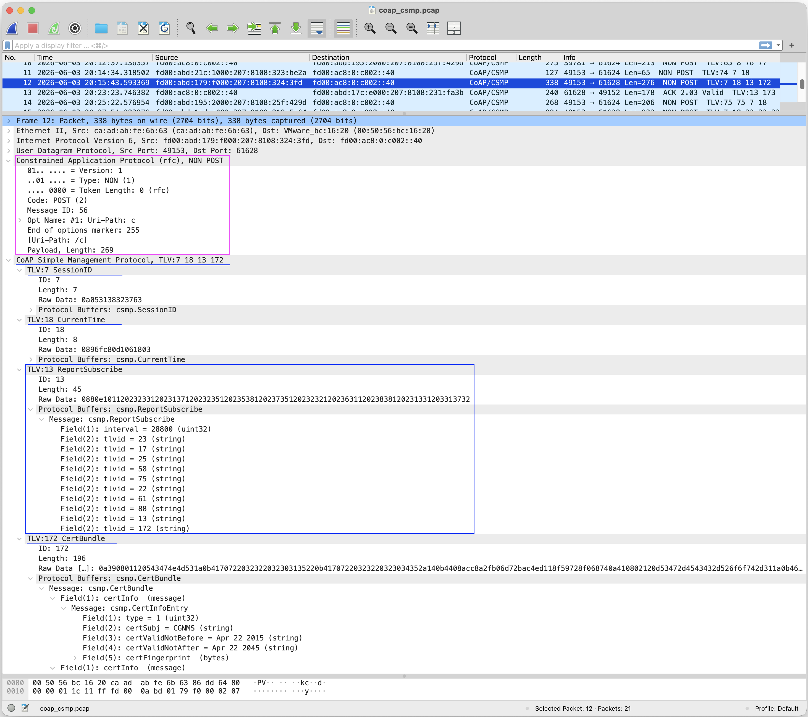
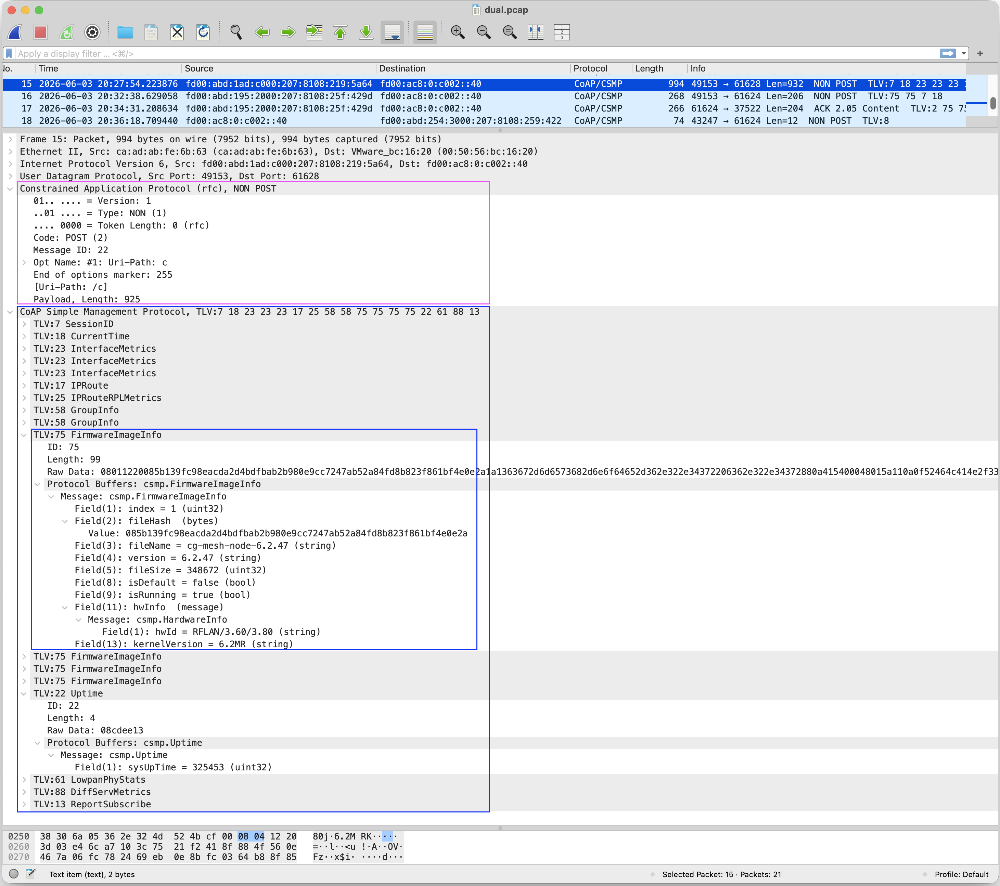

# CoAP CSMP Wireshark Dissector

**Author:**  Manojna CSL, Engineering Technical Lead, Cisco — 
[mcsl@cisco.com](mailto:mcsl@cisco.com) · [manojnacsl@gmail.com](mailto:manojnacsl@gmail.com)  
**GitHub:** [OpenCSMP — Wireshark CSMP Dissector](https://github.com/CiscoDevNet/csmp-agent-lib/tree/main/tools/wireshark-csmp-dissector)


**A Wireshark Lua dissector for CoAP-framed CSMP traffic, TLVs, and Protobuf messages:**  
This is a Wireshark Lua dissector for inspecting
**CSMP (CoAP Simple Management Protocol)** traffic. It is intended to make
CSMP exchanges easier to develop, troubleshoot, and validate by decoding
the transport framing, CoAP metadata, CSMP TLVs, and their application data in
a single Wireshark packet view.

The dissector supports both the CoAP wire format defined by RFC 7252 and
the earlier CoAP draft-12 format used by legacy CSMP deployments. It implements 
its own custom CoAP header decoder for both RFC and draft-12 wire formats. 
It decodes the fixed header, message type and code, Message ID, token or option count,
options, reconstructed URI path, payload marker, and payload. The appropriate
wire format can be selected automatically from the UDP ports and packet header
or explicitly through the dissector's protocol preference.

After extracting the CoAP payload, the dissector interprets it as a sequence
of CSMP Type/Length/Value (TLV) records. It displays each TLV's numeric ID,
encoded length, and raw Value bytes. Known TLV IDs are mapped to message types
defined in `csmp.proto` and passed to Wireshark's built-in Protobuf dissector
for field-level decoding. Unknown TLVs remain visible as raw data, while new
known TLVs can be supported by extending the Protobuf schema and TLV mapping
without redesigning or reimplementing the main dissector. This design therefore 
makes the dissector lightweight, extensible and easy to upgrade and maintain.

## Table of contents

- [Quick start](#quick-start)
- [Features](#features)
- [Installation guide](#installation-guide)
  - [Requirements](#requirements)
  - [Package contents](#package-contents)
  - [Installation methods](#installation-methods)
    - [macOS or Linux](#macos-or-linux)
    - [Windows Command Prompt](#windows-command-prompt)
    - [Manual installation](#manual-installation)
  - [Configure Protobuf schemas](#configure-protobuf-schemas)
  - [Verify the installation](#verify-the-installation)
- [User guide](#user-guide)
  - [Using the dissector](#using-the-dissector)
    - [Supported ports and wire formats](#supported-ports-and-wire-formats)
    - [Using Decode As](#using-decode-as)
  - [CoAP wire-format preference](#coap-wire-format-preference)
  - [Understanding the decoded packet](#understanding-the-decoded-packet)
  - [Display filters](#display-filters)
  - [Debugging FND and CSMP workflows](#debugging-fnd-and-csmp-workflows)
  - [Troubleshooting](#troubleshooting)
  - [Security Considerations and Limitations](#security-considerations-and-limitations)
- [Developer guide](#developer-guide)
  - [Adding a Protobuf-backed TLV](#adding-a-protobuf-backed-tlv)
  - [Reloading and validating changes](#reloading-and-validating-changes)
- [Protocol and deployment context](#protocol-and-deployment-context)
  - [About CoAP](#about-coap)
  - [About CSMP](#about-csmp)
  - [OpenCSMP](#opencsmp)
  - [Cisco IoT Field Network Director and CSMP](#cisco-iot-field-network-director-and-csmp)
- [Changelog](CHANGELOG.md)
- [Version history](#version-history)
- [References](#references)

## Quick start

1. Install `coap_csmp_dissector.lua` and `csmp.proto` into Wireshark's
   **Personal Lua Plugins** directory.

   On macOS or Linux:

   ```sh
   ./install.sh --dry-run
   ./install.sh
   ```

   On Windows Command Prompt:

   ```bat
   install.bat --dry-run
   install.bat
   ```

   See the [Installation guide](#installation-guide) for PowerShell, manual
   installation, and custom target-directory instructions.

2. In Wireshark, open **Preferences/Settings > Protocols > Protobuf**. Add the
   **Personal Lua Plugins** directory to **Protobuf search paths** and enable
   **Load all files** for that path.

3. Choose **Analyze > Reload Lua Plugins**, or restart Wireshark. Confirm that
   `coap_csmp_dissector.lua` appears under
   **Help > About Wireshark > Plugins**.

4. Open a capture containing CoAP CSMP traffic on UDP port `61628` (RFC format) or
   `61624` (draft-12 format). For a nonstandard port, use
   **Analyze > Decode As** and select `CSMP`.

5. Enter `csmp` as the display filter. Expand **Constrained Application
   Protocol** and **CoAP Simple Management Protocol** in the packet-details
   pane to inspect the CoAP fields, CSMP TLVs, and known Protobuf messages.

For mode selection and useful filters, see
[CoAP wire-format preference](#coap-wire-format-preference) and
[Display filters](#display-filters) sections.

## Features

CSMP traffic combines CoAP framing, a TLV container, and Protobuf-encoded
application data. Inspecting only the UDP payload or only the outer CoAP layer
does not provide enough context to understand a complete management exchange.
This dissector presents all of these layers together in Wireshark, allowing a
user to move from a packet-level symptom to the relevant CSMP object and its
decoded fields without needing to manually extract or convert payload bytes.

### Capabilities and Advantages

- **RFC and Draft compatibility:** Decodes CoAP RFC 7252 on UDP `61628` and
  CoAP draft-12 on UDP `61624`, with automatic or explicitly forced mode
  selection.
- **Layered protocol visibility:** Displays the CoAP header, message metadata,
  token, options, URI path, payload, CSMP TLVs, raw Value bytes, and known
  Protobuf fields in one packet tree.
- **Faster fault isolation:** Helps distinguish incorrect CoAP framing, option
  errors, malformed VarInts or TLV lengths, unsupported TLV IDs, and Protobuf
  decoding problems through Expert Information diagnostics.
- **Searchable evidence:** Exposes `csmp.*` display-filter fields so captures
  can be narrowed by message metadata, URI, option number, TLV ID, or TLV
  length.
- **Protobuf decoding with raw fallback:** Decodes known TLV IDs using
  `csmp.proto` while retaining unknown TLVs as raw bytes for later analysis.
- **Extensible TLV support:** Adds new Protobuf-backed TLVs through the schema,
  mapping table, and supplied helper script (add_tlv.sh) without rebuilding 
  Wireshark or the dissector.
- **Cross-platform installation:** Package includes installer scripts for macOS,
  Linux, Windows PowerShell, and Windows Command Prompt.

### Applications

| Audience | How the dissector helps |
|---|---|
| **Software developers** | Validate packet generation and parsing; verify CoAP methods, tokens, options, URI paths, and TLV boundaries; inspect encoded Protobuf fields; confirm new TLV mappings; and compare implementation behavior with captured traffic. |
| **Test and QA engineers** | Build protocol-focused test cases; verify positive, negative, boundary, and malformed-input behavior; filter large regression captures by TLV or CoAP field; and confirm interoperability across RFC and draft deployments. |
| **Support engineers** | Triage customer captures without first reproducing the complete deployment; identify the operation and TLVs involved; locate malformed structures or unknown objects; and collect precise packet-level evidence for escalation. |
| **Field engineers** | Diagnose registration, configuration, reporting, and device-management exchanges at a deployment site; check whether expected requests and responses are present; and separate network reachability symptoms from protocol-format problems. |
| **Customers and operators** | Inspect management exchanges using familiar Wireshark workflows; confirm that devices are communicating on the expected ports and wire format; review the management objects carried in a transaction; and provide focused captures to engineering or support teams. |
| **Protocol and integration teams** | Compare different CSMP implementations, investigate gateway or server interoperability, evaluate draft-to-RFC transitions, and verify that schema changes remain compatible with the observed wire data. |

### Typical debugging workflow

1. Filter the capture with `csmp` and identify the request or response of
   interest from the Type, Code, URI path, and Info column.
2. Check the CoAP mode, header, token or option count, and decoded options for
   framing or request-routing problems.
3. Expand the CSMP payload and inspect its TLV IDs and declared lengths.
4. Expand known Protobuf messages to compare their decoded values with the
   application's expected state.
5. Review Expert Information for truncation, invalid options, malformed
   VarInts, TLV overruns, or Protobuf failures.
6. Save the relevant packets or apply a targeted display filter when sharing
   evidence with development, QA, operations, or customer-support teams.

## Installation guide

This section covers the prerequisites, supplied files, installation methods,
Protobuf configuration, and checks needed to make the dissector operational.

### Requirements

- Wireshark with Lua enabled
- Wireshark's built-in Protobuf dissector (enabled by default)
- `coap_csmp_dissector.lua` and `csmp.proto` available in the same plugin
  directory

The scripts use `tshark -G folders` when possible to locate Wireshark's
**Personal Lua Plugins** directory.

### Package contents

| File | Purpose |
|---|---|
| `coap_csmp_dissector.lua` | CoAP CSMP Wireshark Lua dissector |
| `csmp.proto` | Combined Protobuf schema for known CSMP TLVs |
| `install.sh` | Installer for macOS, Linux, and compatible Unix shells |
| `install.ps1` | PowerShell installer for Windows |
| `install.bat` | `cmd.exe` installer for Windows |
| `add_tlv.sh` | Adds one TLV mapping and its Protobuf message to dissector|
| `CHANGELOG.md` | Detailed version history and notable changes |
| `README.md` | Detailed install/user/developer instructions and feature/protocol information |
| `docs/coap_csmp_dissector_readme.pdf` | Detailed install/user/developer guide with feature/protocol information | 
| `pcap/` | Sample CoAP/CSMP packet capture files |

### Installation methods

#### macOS or Linux

Run the installer from this directory:

```sh
./install.sh --dry-run
./install.sh
```

To install into a specific directory:

```sh
./install.sh --target /path/to/wireshark/plugins
```

#### Windows Command Prompt

```bat
install.bat --dry-run
install.bat
```

To use a specific directory:

```bat
install.bat --target "%APPDATA%\Wireshark\plugins"
```

As an alternative to the Command Prompt installer, PowerShell users can use
`install.ps1`. The script supports automatic plugin-directory detection, a
dry-run option, and a custom target directory; see the script header for usage.

#### Manual installation

1. In Wireshark, open **Help > About Wireshark > Folders** and locate
   **Personal Lua Plugins**.
2. Copy `coap_csmp_dissector.lua` and `csmp.proto` into that directory.
3. Restart Wireshark or choose **Analyze > Reload Lua Plugins**.

### Configure Protobuf schemas

Wireshark must be able to find `csmp.proto` before known TLV values can be
decoded into their message fields.

1. Open Wireshark **Preferences** (called **Settings** on some platforms).
2. Select **Protocols > Protobuf**.
3. Add Wireshark's **Personal Lua Plugins** directory to **Protobuf search paths**.
4. Enable **Load all files** for that path.
5. Apply the preference and reload Lua plugins or restart Wireshark.



Enabling the Protobuf preference that exposes fields as Wireshark fields is
optional. When enabled, generated filters use prefixes such as `pbf.` and
`pbm.` in addition to the native `csmp.*` fields listed below.

### Verify the installation

In the Wireshark GUI, open **Help > About Wireshark > Plugins** and search for
`coap_csmp_dissector.lua`.

With `tshark`:

```sh
tshark -G plugins | grep coap_csmp_dissector.lua
```

The plugin entry should report version `2.0.0`. Lua startup errors are shown in
Wireshark's console or in `tshark` output.

```sh
coap_csmp_dissector.lua	2.0.0	Lua script
/Users/mcsl/.local/lib/wireshark/plugins/coap_csmp_dissector.lua
```

## User guide

This section explains how to select, decode, filter, and troubleshoot CSMP
traffic after the plugin has been installed.

### Using the dissector

#### Supported ports and wire formats

Open a capture containing CSMP traffic. The dissector is registered directly
for these UDP ports:

| UDP port | Default wire format |
|---:|---|
| `61628` | CoAP RFC 7252 |
| `61624` | CoAP draft-12 |

Decoded packets appear with protocol-column text `CoAP/CSMP`. The Info column
includes the CoAP type and code followed by the decoded TLV IDs, for example:

```text
CON POST TLV:7 18 75 340
```

#### Using Decode As

For traffic on a nonstandard port, use Wireshark's **Decode As** facility and
select `CSMP`. In Auto mode, an ambiguous header on a nonstandard port defaults
to the RFC format; set the preference explicitly if the packet uses the Draft
format.

### CoAP wire-format preference

Open **Preferences/Settings > Protocols > CSMP** and set **CoAP mode**:




| Setting | Behavior |
|---|---|
| `Auto` | Select by destination port, then source port, then header fallback |
| `Force RFC` | Decode every selected packet using the RFC 7252 format |
| `Force Draft` | Decode every selected packet using the draft-12 format |

Auto mode uses the following precedence:

1. Destination port `61628` selects RFC.
2. Destination port `61624` selects Draft.
3. Source port `61628` selects RFC.
4. Source port `61624` selects Draft.
5. On other ports, a low header nibble greater than `8` selects Draft because
   RFC token lengths are limited to eight bytes.
6. An ambiguous low nibble from `0` through `8` selects RFC.

The destination-port rule takes precedence when the two well-known ports occur
in opposite directions in the same packet.

### Understanding the decoded packet

#### RFC 7252 format

The dissector decodes the four-byte fixed header, a token of zero to eight
bytes, delta-encoded options, the `0xFF` payload marker, and the remaining CSMP
payload. A payload marker with no following payload is reported as malformed.

#### Draft-12 format

The low nibble of the first byte is interpreted as the Option Count (OC). The
dissector supports draft option lengths, option jumps, the `0xF0` end-of-options
marker used when OC is `15`, URI-path assembly, and payload extraction.

#### Empty CoAP messages

A message with Code `0.00` never reaches option or CSMP TLV decoding.

- RFC: TKL must be zero and the message must contain exactly the four-byte
  fixed header. Violations are marked malformed.
- Draft: nonzero OC or trailing bytes produce a warning, and the remaining
  bytes are ignored.

#### CSMP TLVs

Each extracted CSMP payload is interpreted as a sequence of:

```text
+----------------+----------------+------------------+
| ID VarInt      | Length VarInt  | Value bytes      |
+----------------+----------------+------------------+
```

ID and Length are unsigned, base-128 VarInts limited to the `uint32` range and
at most five bytes each. Length is the number of following Value bytes.

If an ID exists in `protobufMessageMap`, the Value is decoded using the mapped
message from `csmp.proto`. An unmapped ID remains visible as an `Unknown` TLV
with its raw bytes.





### Display filters

| Filter | Meaning |
|---|---|
| `csmp` | All packets decoded by this dissector |
| `csmp.ver` | CoAP version |
| `csmp.type` | CoAP message type |
| `csmp.tkl` | RFC token length |
| `csmp.oc` | Draft option count |
| `csmp.code` | CoAP code byte |
| `csmp.mid` | Message ID |
| `csmp.token` | RFC token |
| `csmp.option.number` | Decoded option number |
| `csmp.option.delta` | Decoded option delta |
| `csmp.option.delta_nibble` | Encoded option-delta nibble |
| `csmp.option.length` | Decoded option length |
| `csmp.option.length_nibble` | Encoded option-length nibble |
| `csmp.option.name` | Option name |
| `csmp.option.description` | Option number and critical/safety classification |
| `csmp.option.value` | Raw option value |
| `csmp.uri_path` | Reconstructed URI path |
| `csmp.payload_marker` | RFC or Draft payload marker |
| `csmp.payload` | Raw CSMP payload |
| `csmp.tlvid` | CSMP TLV ID |
| `csmp.tlvlen` | CSMP TLV Value length |
| `csmp.tlvdata` | Raw TLV Value bytes |

Examples:

```text
csmp.tlvid == 2
csmp.code == 2
csmp.uri_path == "/example/path"
csmp.option.number == 12
```

### Debugging FND and CSMP workflows

This dissector exposes the on-wire transaction that connects an FND operation
to the device response. It complements the FND user interface and server logs
by decoding the CoAP exchange, CSMP TLV sequence, and known Protobuf values.
For product and protocol context, see
[Cisco IoT Field Network Director and CSMP](#cisco-iot-field-network-director-and-csmp).

| Workflow | What to verify in Wireshark |
|---|---|
| **Registration and session establishment** | Request direction and order, URI path, response code, identity and session TLVs, Tokens, and Message IDs. |
| **Metrics and reporting** | Report or subscription TLVs, timestamps, expected metric IDs and values, and the corresponding FND acknowledgement or response. |
| **Configuration and device operations** | Requested URI and TLVs, encoded configuration values, device response code, and any returned status TLVs. |
| **Events and firmware management** | Event, transfer, image, load, response, or firmware-information TLVs; message sequence; and malformed or truncated data. |
| **Interoperability failures** | UDP port and selected RFC/Draft mode, unknown TLV IDs, schema mismatches, invalid options or VarInts, TLV overruns, and Protobuf errors. |

For effective troubleshooting, correlate the device EID, operation, status,
and timestamp in FND with the related server-log entries and packet capture.
Use Message IDs for CoAP acknowledgement behavior, Tokens for matching requests
and responses, and identity or session TLVs for associating the exchange with
the managed endpoint. This helps locate whether the workflow stopped before a
request reached its peer, during message decoding or CSMP processing, or while
returning the response.

The dissector does not decrypt protected CSMP traffic or validate certificates
and cryptographic signatures. Capture or authorized decryption must expose the
required protocol layers before they can be decoded; see
[Security Considerations and Limitations](#security-considerations-and-limitations).

For supported FND behavior and Cisco troubleshooting procedures, see
[Troubleshoot CSMP Registration on Field Area Networks](https://www.cisco.com/c/en/us/support/docs/cloud-systems-management/iot-field-network-director/221895-troubleshoot-csmp-registration-on-field.html)
and the
[Cisco Resilient Mesh configuration guide](https://www.cisco.com/c/en/us/td/docs/routers/connectedgrid/cgr1000/ios/modules/wpan_cgmesh/b_wpan_cgmesh_IOS_cfg.html).

### Troubleshooting

#### Packets remain UDP

- Confirm that the traffic uses UDP `61628` or `61624`.
- For a different port, use **Decode As > CSMP**.
- Confirm that the plugin appears in **About Wireshark > Plugins**.
- Check the console for Lua loading errors.

#### TLVs appear but Protobuf fields do not

- Confirm that `csmp.proto` is installed beside the Lua file.
- Add that directory to the Protobuf search paths and enable **Load all files**.
- Confirm that the TLV ID is present in both `protobufMessageMap` and the
  `// TLV_ID:` entries in `csmp.proto`.
- Confirm that the mapped name, including the `csmp.` package prefix and case,
  exactly matches the Protobuf message name.

#### Draft packets are decoded as RFC

Auto detection is unambiguous on the two registered well-known ports: UDP 61628, 61624.  
Well-known port 61628 selects RFC and 61624 selects draft-12 CoAP format.  
With **Decode As** or a nonstandard port, low header values from zero through eight are ambiguous and therefore default to RFC.  
Set **CoAP mode** to **Force Draft** to force decoding the packet as draft-12 CoAP format.

#### A packet is reported as malformed

Inspect Wireshark's Expert Information details. The dissector reports the first
structural error it encounters, such as an invalid token length, truncated
option extension, missing payload after a marker, invalid VarInt, or a TLV
length extending beyond the payload.

### Security Considerations and Limitations

- Traffic selected on the registered ports is assumed to carry CSMP. Any
  extracted non-empty CoAP payload is interpreted as CSMP TLVs.
- The dissector does not decrypt protected CSMP traffic. Depending on the
  security layer, only some CoAP framing may remain visible or the complete
  application message may be opaque; the required layers must already be
  visible or decrypted through an authorized workflow before they can be
  dissected.
- The dissector is registered on UDP ports only; it is not registered globally
  for `application/octet-stream` or another media type.
- Common CoAP options are named and formatted. Other option numbers remain
  visible as unknown opaque options.
- Validation is primarily structural. The dissector does not enforce every
  method-, response-, option-, or message-type semantic rule from the CoAP
  specifications.
- The Draft decoder targets the older draft-12 layout for compatibility; it is
  distinct from RFC 7252.

## Developer guide

This section describes the supported extension workflow for adding new CSMP
TLV types and confirming that Wireshark can decode them.

### Adding a Protobuf-backed TLV

Prepare a `.proto` input file containing one top-level message of the new TLV being added. 
The `proto3` syntax and `package csmp;` declarations are optional. When present, they must 
specify `proto3` and the `package csmp;`.

Example input protobuf file:

```proto
message ExampleTLV {
  optional uint32 field1 = 1;
  optional string field2 = 2;
  optional bool field3 = 3;
}
```

Validate the proposed addition first:

```sh
./add_tlv.sh --dry-run 700 example_tlv700.proto
```

Then apply it:

```sh
./add_tlv.sh 700 example_tlv700.proto
```

The helper add_tlv.sh inserts:

- `// TLV_ID: 700` and the message into `csmp.proto`, ordered by TLV ID
- `[700] = "csmp.ExampleTLV"` into `protobufMessageMap`

The helper rejects duplicate IDs, duplicate message names, imports, mismatched
packages, non-proto3 syntax, unbalanced definitions, and files containing zero
or multiple top-level messages. The accepted TLV ID range is `1` through
`4294967295`.

### Reloading and validating changes

After updating, reinstall `coap_csmp_dissector.lua` and `csmp.proto` if this
source directory is not already Wireshark's **Personal Lua Plugins** directory.
Then choose **Analyze > Reload Lua Plugins**, or restart Wireshark.

Confirm that the plugin still appears under **Help > About Wireshark >
Plugins**, open a representative capture, and verify both the new TLV mapping
and its decoded Protobuf fields. If the TLV appears only as raw bytes, recheck
the Protobuf search path, the `csmp.` package-qualified message name, and the
mapping in `protobufMessageMap`.

## Protocol and Deployment Context

This section provides context for the protocols and product workflows that
the dissector exposes. It is not required for installation, so readers who
already know CoAP and CSMP can use it as reference material.

### About CoAP

The [Constrained Application Protocol (CoAP)](https://www.rfc-editor.org/rfc/rfc7252.html)
is a compact application-layer web transfer protocol designed for constrained
devices and networks, such as low-power IoT nodes and lossy wireless networks.
It provides a REST-style request/response model similar to HTTP while keeping
message overhead and implementation complexity low.

CoAP resources are identified by URIs and operated on with familiar methods
such as GET, POST, PUT, and DELETE. A CoAP message has a four-byte fixed header
followed, when present, by a token, options, and a payload. The protocol defines
four message types:

- **Confirmable (CON):** requires an Acknowledgement or Reset response.
- **Non-confirmable (NON):** does not require transport-level acknowledgement.
- **Acknowledgement (ACK):** acknowledges a Confirmable message and may also
  carry a response.
- **Reset (RST):** indicates that a message was received but could not be
  processed in its current context.

Tokens correlate requests with responses, while Message IDs support duplicate
detection and match Confirmable messages with ACK or RST messages. Options
carry request and representation metadata such as URI path, content format,
block transfer information, and observation parameters.

The final CoAP wire format is defined by RFC 7252. CSMP deployments may also
contain traffic using the earlier CoAP draft-12 format. A key framing
difference is that the low nibble of the first header byte represents Token
Length (TKL) in RFC 7252 and Option Count (OC) in draft-12. This dissector
supports both layouts and provides a preference for selecting or automatically
detecting the appropriate format.

RFC 7252 defines UDP port `5683` for the `coap` URI scheme and UDP port
`5684` for DTLS-secured `coaps`. Later specifications also define CoAP over
reliable transports such as TCP, TLS, and WebSockets. This plugin is narrower:
it registers only for the CSMP UDP ports `61628` and `61624`. Encrypted packet
contents must be decrypted before their CoAP and CSMP structure can be
inspected.

#### CoAP message format

In the RFC 7252 UDP mapping, every CoAP message begins with a compact 32-bit
fixed header:

```text
 0                   1                   2                   3
 0 1 2 3 4 5 6 7 8 9 0 1 2 3 4 5 6 7 8 9 0 1 2 3 4 5 6 7 8 9 0 1
+-+-+-+-+-+-+-+-+-+-+-+-+-+-+-+-+-+-+-+-+-+-+-+-+-+-+-+-+-+-+-+-+
|Ver| T |  TKL  |      Code     |          Message ID           |
+-+-+-+-+-+-+-+-+-+-+-+-+-+-+-+-+-+-+-+-+-+-+-+-+-+-+-+-+-+-+-+-+
| Token (0-8 bytes) ...
+-+-+-+-+-+-+-+-+-+-+-+-+-+-+-+-+-+-+-+-+-+-+-+-+-+-+-+-+-+-+-+-+
| Options (if any) ...
+-+-+-+-+-+-+-+-+-+-+-+-+-+-+-+-+-+-+-+-+-+-+-+-+-+-+-+-+-+-+-+-+
| 0xFF | Payload (if any) ...
+-+-+-+-+-+-+-+-+-+-+-+-+-+-+-+-+-+-+-+-+-+-+-+-+-+-+-+-+-+-+-+-+
```

| Field | Size | Purpose |
|---|---:|---|
| Version (Ver) | 2 bits | Identifies the CoAP version. RFC 7252 uses version `1`; other values are reserved. |
| Type (T) | 2 bits | Selects CON, NON, ACK, or RST messaging behavior. It controls acknowledgement and reset handling, not the request method or response result. |
| Token Length (TKL) | 4 bits | Gives the Token length in bytes. RFC 7252 permits values `0` through `8`; values `9` through `15` are format errors. In draft-12 this nibble instead carries the Option Count. |
| Code | 8 bits | Identifies a request method, response status, or Empty message. It is displayed as `class.detail`: `0.01` is GET, `0.02` is POST, `2.05` is Content, and `0.00` is Empty. |
| Message ID | 16 bits | Detects duplicate messages and matches a CON message with its ACK or RST. It is not the request/response correlation identifier. |
| Token | 0-8 bytes | Correlates a response with its request. A client chooses the Token, and the server echoes it in the corresponding response. |
| Options | Variable | Carry URI components, representation metadata, caching controls, observation state, block-transfer state, and other extensions. Options are encoded in increasing option-number order using delta and length fields. |
| Payload marker | 1 byte | The value `0xFF` separates RFC options from a non-empty payload. It is omitted when there is no payload and is invalid if no payload bytes follow it. |
| Payload | Variable | Carries the resource representation or request data. In the packets targeted by this plugin, it carries the CSMP TLV stream. |

The Code byte is split conceptually into a three-bit class and a five-bit
detail. Class `0` contains requests, class `2` successful responses, class `4`
client errors, and class `5` server errors. The message Type and Code are
independent: for example, a response can be carried in an ACK or sent later in
a separate CON or NON message.

Message ID and Token also serve different purposes. Message ID belongs to the
message layer and is used for acknowledgement and duplicate detection. Token
belongs to the request/response layer and continues to identify an exchange
even when its response is carried in a different CoAP message.

#### Common CoAP options

CoAP options extend a message without enlarging its fixed header. This
dissector recognizes the following commonly encountered options, among others:

| Option | Purpose |
|---|---|
| Uri-Host, Uri-Port | Identify the destination authority when it cannot be inferred from the transport endpoint. |
| Uri-Path | Carries one URI path segment per occurrence; the segments are joined to reconstruct the resource path. |
| Uri-Query | Carries one query component per occurrence. |
| Content-Format | Identifies the media type and representation format of the payload. |
| Accept | Indicates which response content format the client prefers. |
| Observe | Registers, updates, or cancels an observation relationship so a server can send resource-state notifications. |
| Block1 | Controls block-wise transfer of a request payload. |
| Block2 | Controls block-wise transfer of a response payload. |
| Size1, Size2 | Indicate the size of a complete request or response representation. |
| ETag, If-Match, If-None-Match | Support validation, caching, and conditional requests. |
| Max-Age | States how long a response may be considered fresh. |
| Location-Path, Location-Query | Describe the URI of a resource created by a request. |
| Proxy-Uri, Proxy-Scheme | Direct a request through a proxy or identify the target URI scheme. |

Observe is defined by
[RFC 7641](https://www.rfc-editor.org/rfc/rfc7641.html). Block-wise transfer
allows large representations to be exchanged as smaller application-layer
blocks, reducing reliance on lower-layer fragmentation.

#### Uses and applications

CoAP is useful when endpoints or networks cannot efficiently support the
connection, memory, bandwidth, or power costs typical of general-purpose web
protocols. Common applications include:

- **Device management:** provisioning, configuration, status retrieval,
  diagnostics, software control, and lifecycle operations such as those
  carried by CSMP.
- **Telemetry and sensing:** reading temperature, power, occupancy, meter, or
  equipment-health resources from constrained nodes.
- **Actuation and control:** changing set points, operating relays, controlling
  lighting, or updating actuator state through REST-style resource operations.
- **Smart energy and utilities:** field-area networks, metering, distribution
  automation, and monitoring over bandwidth-constrained links.
- **Building and industrial automation:** discovery and control of sensors,
  controllers, and equipment with small embedded implementations.
- **Resource observation:** receiving asynchronous updates when a resource
  changes instead of repeatedly polling it.
- **Group communication:** sending a multicast request to a group of endpoints,
  where the deployment and security model permit it.
- **Edge-to-web integration:** translating between CoAP resources and HTTP APIs
  through a gateway or cross-protocol proxy.

CoAP can use Confirmable messages when acknowledgement and retransmission are
needed, or Non-confirmable messages when occasional loss is acceptable and
minimum exchange overhead is preferred. This per-message choice is useful for
applications containing both critical control traffic and periodic telemetry.

#### Advantages and comparison with related protocols

CoAP's main advantages are its four-byte base header, compact binary option
encoding, lack of a mandatory persistent connection, optional message-level
reliability, multicast support, REST-compatible resource model, and extensions
for observation and block-wise transfer. These properties can reduce code
size, radio airtime, energy consumption, and fragmentation on constrained
links. They also make CoAP-to-HTTP gateways relatively straightforward.

The protocols below are complementary in many architectures rather than
direct replacements for one another:

| Protocol | Interaction model | Typical transport/topology | Relative strengths and best fit |
|---|---|---|---|
| **CoAP** | REST-style request/response; Observe adds resource notifications | Commonly UDP, directly between endpoints or through proxies | Compact resource access, multicast, constrained nodes, lossy low-power networks, and local device control. Applications must account for datagram sizing, loss, NAT/firewall behavior, and CoAP-specific security deployment. |
| **HTTP** | REST-style request/response | TCP/TLS or HTTP/3 over QUIC; client/server and proxy infrastructure | Broad browser, server, authentication, caching, and developer-tool support. It is usually the natural choice for web and cloud APIs, while its transport and header overhead can be less attractive on highly constrained links. CoAP was deliberately designed to map to HTTP at gateways. |
| **MQTT** | Brokered publish/subscribe organized by topics | Long-lived client connections, normally over TCP/TLS, through a broker | Strong fit for asynchronous telemetry distribution, many-to-many fan-out, retained messages, persistent sessions, and selectable delivery QoS. It requires broker infrastructure and does not natively expose a REST resource model or CoAP-style multicast. |


Choose CoAP when compact, direct resource access and constrained-network
behavior are central. Choose HTTP when universal Web interoperability and
infrastructure matter more than endpoint cost. Choose MQTT when brokered
publish/subscribe and telemetry fan-out are primary requirements.

### About CSMP

**CoAP Simple Management Protocol (CSMP)** is a device lifecycle-management
protocol designed for resource-constrained devices deployed in large-scale,
bandwidth-constrained IoT networks. It uses CoAP's lightweight RESTful exchange
model to carry device-management requests, responses, configuration, status,
and operational data.

#### Origin and evolution

CSMP originated in Cisco's Industrial IoT and field-network deployments. It
was developed to provide enterprise device-management functions over networks
whose endpoints, bandwidth, latency, power, and memory are significantly more
constrained than conventional IT systems. These environments still require
device registration, configuration, monitoring, alarm reporting, firmware
updates, and security, but must perform those operations with compact messages
and small embedded implementations.

Cisco deployed CSMP with Cisco Resilient Mesh and Wi-SUN Field Area Networks
for critical-infrastructure applications such as utility metering, utility
distribution automation, and municipal street lighting. When Cisco announced
OpenCSMP in February 2024, it reported that CSMP had been deployed for nearly a
decade and was managing tens of millions of Industrial IoT devices.

The protocol combines a profile of CoAP with Protocol Buffers. CoAP supplies
compact REST-style resources, methods, response codes, and message handling;
CSMP defines the management resources and TLV-based object model; and Protobuf
provides an efficient binary representation for individual management
objects. This combination supports device registration, configuration,
firmware management, status and metric reporting, and event or fault
notification without requiring a heavyweight Web stack on the endpoint.

#### Protocol and encoding model

CSMP represents a CoAP payload as a sequence of Type/Length/Value (TLV) tuples.
The Type is the numeric CSMP TLV ID, the Length describes the encoded Value,
and the Value for a known TLV is a Google Protocol Buffers message. This model
keeps the on-wire representation compact while allowing the set of management
objects to evolve through new TLV IDs and Protobuf message definitions.

The protocol layers decoded by this plugin are:

```text
UDP
 └─ CoAP header, token, and options
     └─ CSMP TLV stream
         └─ Protobuf message for each known TLV Value
```

The Lua dissector handles the CoAP and TLV framing. For every TLV ID listed in
its `protobufMessageMap`, it asks Wireshark's built-in Protobuf dissector to
decode the Value using the corresponding message in `csmp.proto`. Unknown TLVs
remain visible with their numeric ID, declared length, and raw Value bytes.

### OpenCSMP

In 2024, Cisco made CSMP publicly available as
[OpenCSMP](https://github.com/CiscoDevNet/csmp-agent-lib) for use and community
development beyond Cisco's original device ecosystem. The CiscoDevNet project
is licensed under Apache License 2.0 and provides a C implementation of the
CSMP agent library, a sample agent application, platform-abstraction support,
developer documentation, tests, protocol-related tools, and Protobuf TLV
definitions.

The OpenCSMP repository currently includes support for Linux, FreeRTOS,
Silicon Labs EFR32 Wi-SUN, and Renesas Wi-SUN FAN targets through its Operating
System Abstraction Layer and vendor integrations. Its sample agent can
register with and report metrics to Cisco IoT FND, providing a reference for
porting CSMP to third-party constrained devices. Cisco IoT FND documentation
also describes onboarding supported third-party endpoints through OpenCSMP.

This Wireshark dissector complements the OpenCSMP agent and development tools.
It provides an independent view of the generated wire traffic, decodes the
CoAP and CSMP framing, and uses `csmp.proto` to display known TLV Values. That
makes it useful when developing an agent port, adding a TLV, validating FND
integration, comparing two implementations, or investigating a captured
interoperability failure.

For project source, build instructions, platform integrations, contribution
guidelines, and the current implementation status, see the
[OpenCSMP CSMP Agent Library on CiscoDevNet](https://github.com/CiscoDevNet/csmp-agent-lib).

### Cisco IoT Field Network Director and CSMP

[Cisco IoT Field Network Director (IoT FND)](https://www.cisco.com/c/en/us/products/cloud-systems-management/iot-field-network-director/index.html)
uses CSMP to manage supported embedded devices and Cisco Resilient Mesh
endpoints. CSMP carries registration, configuration, status, metrics, event,
notification, and firmware-management data between IoT FND and devices.

The communication is bidirectional. A device-side CSMP client sends requests
to resources provided by IoT FND for workflows such as registration and
reporting. The IoT FND CSMP client sends requests to resources provided by the
device for management and data retrieval. Cisco Resilient Mesh communication
with FND uses the RFC CoAP port `61628`; the draft port `61624` remains relevant
to older or compatibility traffic.

## Version history

Current dissector version: **2.0.0**

See [CHANGELOG.md](CHANGELOG.md) for detailed release notes.

- 2.0.0  Code cleanup, feature/regression/coap-mode testing, add_tlv.sh testing. Add README.md, CHANGELOG.md
- 1.9.0  Add helper scripts to install and add new TLV/Protobuf to dissector plugin
- 1.8.0  Add protocol preferences for CoAP wire format selection, Harden CoAP mode detection
- 1.7.0  VarInt overflow handling, CoAP version validation, Option parsing, Token/URI extraction
- 1.6.0  Use common protobufMessageMap for both TLV names and protobuf names
- 1.5.0  Add more TLV support, Update csmp.proto
- 1.4.0  Add CoAP mode differentiation and CoAP header field parsing
- 1.3.0  Add custom CoAP header decoding
- 1.2.0  Support CoAP Draft (UDP61624)
- 1.1.0  Add selected TLV support, Update csmp.proto
- 1.0.0  Support CoAP RFC (UDP61628), Protobuf decoding

## References

- [Wireshark](https://www.wireshark.org/)
- [OpenCSMP CSMP Agent Library](https://github.com/CiscoDevNet/csmp-agent-lib)
- [CSMP Dissector on OpenCSMP GitHub](https://github.com/CiscoDevNet/csmp-agent-lib/tree/main/tools/wireshark-csmp-dissector)
- [RFC 7252: The Constrained Application Protocol (CoAP)](https://www.rfc-editor.org/rfc/rfc7252.html)
- [CoAP draft-12](https://datatracker.ietf.org/doc/html/draft-ietf-core-coap-12)
- [RFC 7641: Observing Resources in CoAP](https://www.rfc-editor.org/rfc/rfc7641.html)
- [RFC 7959: Block-Wise Transfers in CoAP](https://www.rfc-editor.org/rfc/rfc7959.html)
- [RFC 8323: CoAP over TCP, TLS, and WebSockets](https://www.rfc-editor.org/rfc/rfc8323.html)
- [RFC 9110: HTTP Semantics](https://www.rfc-editor.org/rfc/rfc9110.html)
- [OASIS MQTT Version 5.0](https://docs.oasis-open.org/mqtt/mqtt/v5.0/mqtt-v5.0.html)
- [Cisco: Troubleshoot CSMP Registration on Field Area Networks](https://www.cisco.com/c/en/us/support/docs/cloud-systems-management/iot-field-network-director/221895-troubleshoot-csmp-registration-on-field.html)
- [Cisco Resilient Mesh Configuration Guide: CSMP](https://www.cisco.com/c/en/us/td/docs/routers/connectedgrid/cgr1000/ios/modules/wpan_cgmesh/b_wpan_cgmesh_IOS_cfg.html#con_1032536)
- [Cisco: Announcing OpenCSMP](https://blogs.cisco.com/developer/cisco-announces-availability-of-opencsmp/)
- [Cisco IoT FND User Guide: OpenCSMP](https://www.cisco.com/c/en/us/td/docs/routers/connectedgrid/iot_fnd/guide/4_10/b-iot-fnd-user-guide-410/m-integrating-endpoints-in-iot-fnd-through-csmp.html)
